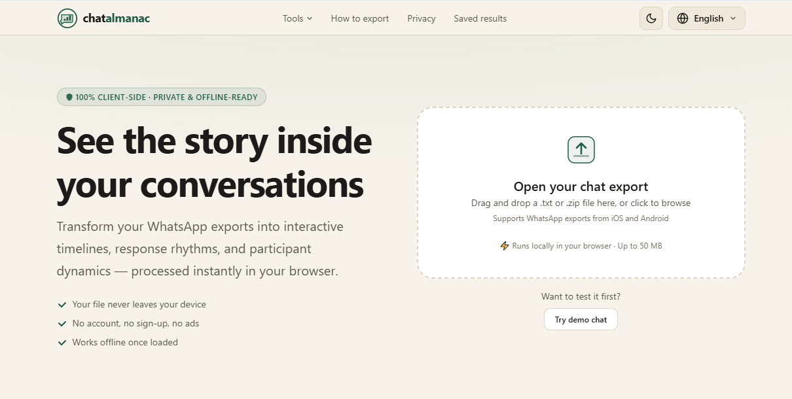
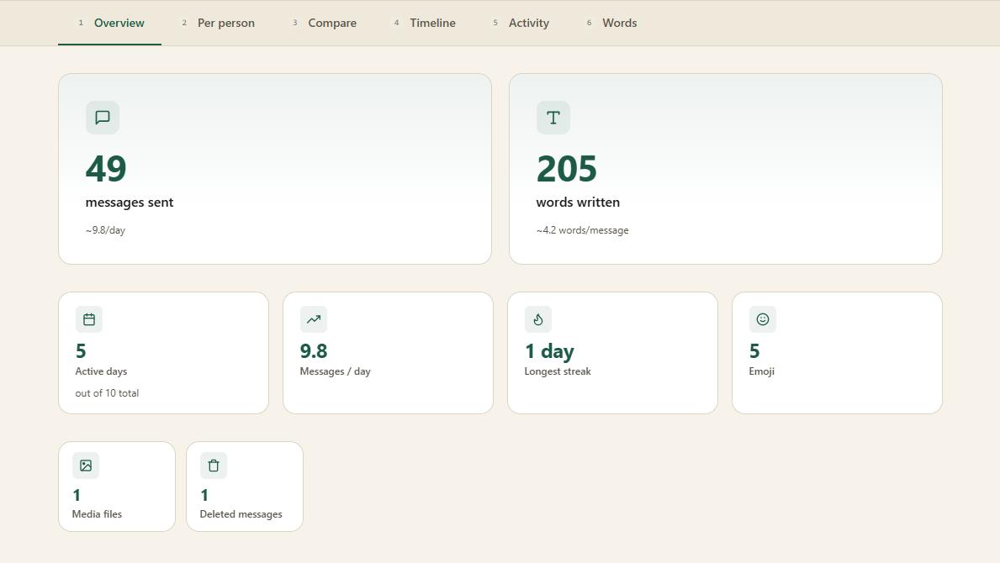
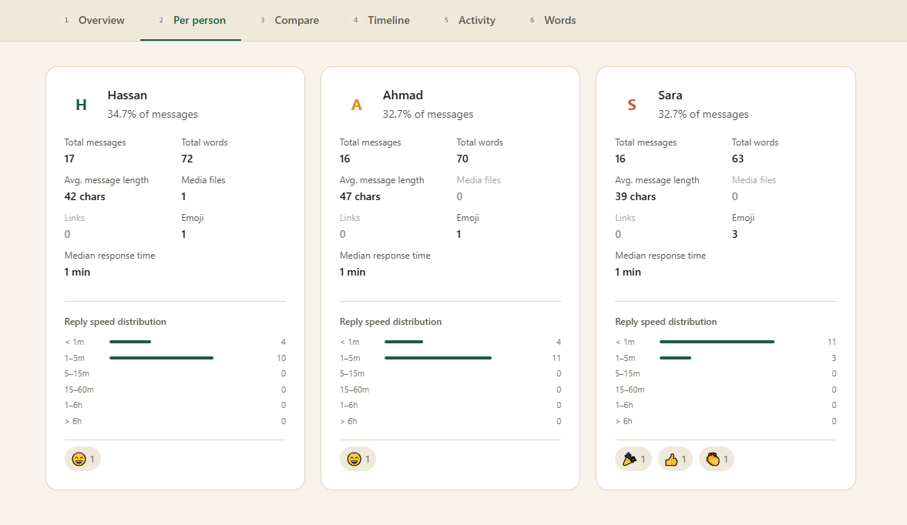
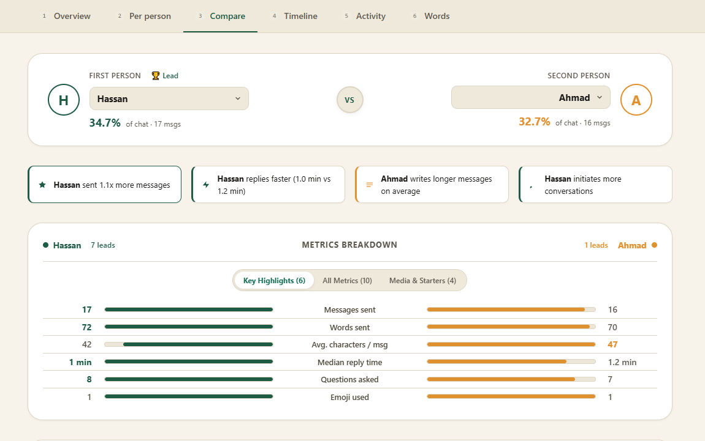
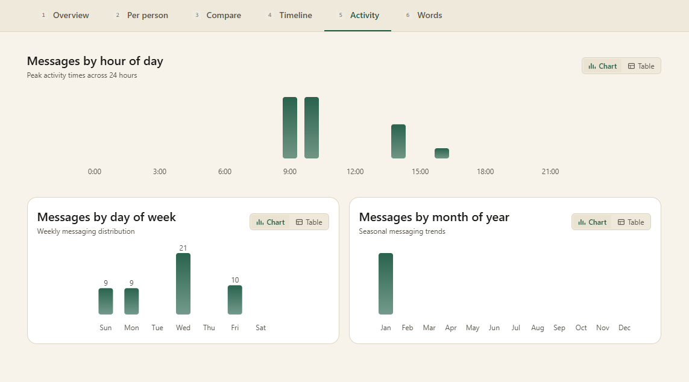
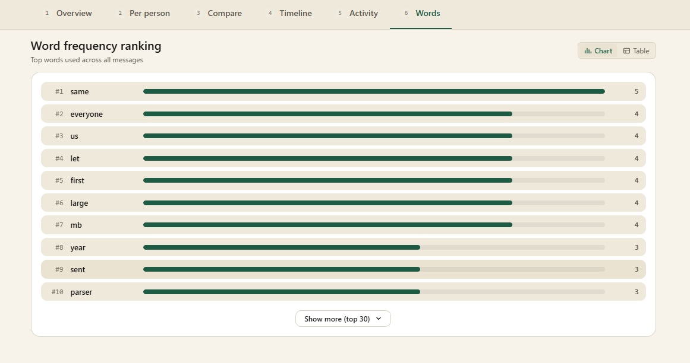
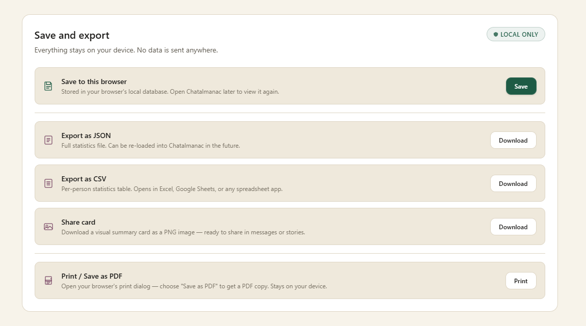

<div align="center">

# chatalmanac

**Private, browser-based analytics for your WhatsApp conversations.**

[](https://opensource.org/licenses/MIT)
[](https://www.typescriptlang.org/)
[](https://vitejs.dev/)
[](./docs/handover.md)
[](./src/sw.ts)

> **Your files never leave your device.** All parsing, analysis, and rendering run inside your browser via Web Workers and the Canvas API. No server, no uploads, no tracking.

</div>

---

## Table of Contents

- [Overview](#overview)
- [Feature walkthrough](#feature-walkthrough)
  - [1 — Upload your chat export](#1--upload-your-chat-export)
  - [2 — Overview dashboard](#2--overview-dashboard)
  - [3 — Per-person breakdown](#3--per-person-breakdown)
  - [4 — Head-to-head compare](#4--head-to-head-compare)
  - [5 — Timeline and activity heatmap](#5--timeline-and-activity-heatmap)
  - [6 — Word and emoji frequency](#6--word-and-emoji-frequency)
  - [7 — Export and save](#7--export-and-save)
- [Privacy verification](#privacy-verification)
- [Getting started](#getting-started)
- [Available commands](#available-commands)
- [Project structure](#project-structure)
- [Deployment](#deployment)
- [Legal notices](#legal-notices)
- [License](#license)

---

## Overview

Chatalmanac turns a plain WhatsApp `.txt` export file into a rich interactive report — timelines, word clouds, emoji breakdowns, response-time statistics, head-to-head comparisons, and more — all computed locally in your browser.

**Key principles:**

| Principle | How it is enforced |
|-----------|------------------|
| Zero data transmission | A strict `Content-Security-Policy: connect-src 'none'` header blocks all outbound requests |
| Works offline | A Service Worker caches all app assets after the first visit |
| Local-only storage | IndexedDB stores only computed numbers, never raw message text |
| Auditable | `npm run audit:privacy` scans every production file for network call patterns |
| Accessible | Full keyboard navigation, screen-reader labels, reduced-motion support, and chart/table view toggles |
| Multilingual | English, Urdu, Arabic (RTL), French — detected from your browser language setting |

---

## Feature walkthrough

### 1 — Upload your chat export

Drop your WhatsApp export `.txt` file onto the import zone, or click to browse. The parser auto-detects the format (iOS, Android, 12h/24h clock, single-line or multi-line messages).

> **How to export from WhatsApp**
> Open a chat → three-dot Menu → More → Export Chat → Without Media → share the `.txt` file to yourself.



---

### 2 — Overview dashboard

After parsing, you land on the **Overview** tab showing headline numbers across the entire conversation:

- Total messages, active days, longest streak, total words
- Message share bar chart per participant
- First and last message timestamps
- Response-time distribution



---

### 3 — Per-person breakdown

Switch to the **Per Person** tab for an individual deep-dive:

- Message count, word count, average message length
- Top emojis, top words, link count, media count
- Questions asked and response patterns
- Individual activity heatmap



---

### 4 — Head-to-head compare

The **Compare** tab puts any two participants side-by-side:

- Who replies faster (median response time)
- Who initiates more conversations
- Who asks more questions
- Favorite emojis compared



---

### 5 — Timeline and activity heatmap

The **Timeline** and **Activity** tabs reveal patterns over time:

- Day-by-day message volume line chart
- Hour-of-day heatmap (when is everyone most active?)
- Inactivity gap detector — longest silent periods



---

### 6 — Word and emoji frequency

The **Words** tab shows what your group actually talks about:

- Top-100 word frequency chart (stop-words removed)
- Top emojis by count
- Accessible chart/table toggle on every visualization



---

### 7 — Export and save

At the bottom of the Results view, the **Export panel** lets you:

| Action | Output |
|--------|--------|
| Save to this browser | Stores the analysis in your browser's IndexedDB — reopen Chatalmanac later to view it again |
| Export as JSON | Full lossless backup; re-importable into Chatalmanac |
| Export as CSV | Per-person stats table — opens in Excel, Google Sheets, etc. |
| Share card | Downloads a 900x500 px PNG summary image, ready to share |
| Print / Save as PDF | Opens your browser's print dialog; choose "Save as PDF" to get a local PDF copy |



---

## Privacy verification

You do not need to trust the privacy claim — you can verify it yourself in under 60 seconds:

1. Press **F12** to open Developer Tools.
2. Go to the **Network** tab and enable **Preserve log**.
3. Open `http://localhost:5173/` and drop in a chat file.
4. Watch the Network tab during the entire parse-and-render cycle.
5. **Zero network requests will appear** for your data. The only requests are initial asset loads (HTML, JS, CSS, fonts) — never your chat content.

The `_headers` file and Vite's `Content-Security-Policy: connect-src 'none'` header make it technically impossible for the app to phone home in production.

---

## Getting started

### Prerequisites

| Tool | Minimum version |
|------|----------------|
| [Node.js](https://nodejs.org/) | 18.0 |
| npm | 9.0 |

### Installation

```bash
# Clone the repository
git clone https://github.com/mtayyab-10/chatalmanac.git
cd chatalmanac

# Install dependencies
npm install
```

### Running locally

```bash
npm run dev
```

Open **http://localhost:5173** in your browser.

### Building for production

```bash
npm run build
```

Optimized, minified output is written to `dist/`. The build also runs the privacy audit automatically.

---

## Available commands

| Command | Description |
|---------|-------------|
| `npm run dev` | Start the Vite development server with HMR on port 5173 |
| `npm run build` | Create a production bundle in `dist/` |
| `npm run preview` | Serve the production build locally on port 4173 |
| `npm test` | Run the full Vitest test suite (parser, storage, compare analytics) |
| `npm run audit:privacy` | Scan all built files for runtime network call patterns and tracking code |

---

## Project structure

```text
chatalmanac/
├── src/
│   ├── parser/             # Chat file parsing — date detection, format recognition, multi-line support
│   ├── worker/             # Background Web Worker for non-blocking statistics calculation
│   ├── storage/
│   │   ├── db.ts           # IndexedDB wrapper (save / load / delete analyses)
│   │   └── exports.ts      # JSON, CSV, PNG share card, and print export handlers
│   ├── utils/
│   │   └── sanitize.ts     # CSV cell sanitisation (formula-injection prevention)
│   ├── ui/
│   │   ├── app.ts          # Application state machine and navigation (hash-based routing)
│   │   ├── components/
│   │   │   ├── charts.ts         # Bar charts, heatmaps, line charts (accessible chart/table toggle)
│   │   │   ├── export-panel.ts   # Save / export actions panel
│   │   │   ├── import-zone.ts    # Drag-and-drop file import area
│   │   │   ├── nav.ts            # Top navigation bar and mobile drawer
│   │   │   └── footer.ts         # Site footer with CTA and links
│   │   ├── views/
│   │   │   ├── landing.ts        # Hero and import section
│   │   │   ├── loading.ts        # Progress and error screens
│   │   │   ├── results.ts        # Full results dashboard (6 tabs)
│   │   │   ├── saved.ts          # Saved analyses manager
│   │   │   ├── export-guide.ts   # How-to-export walkthrough
│   │   │   └── privacy.ts        # Privacy policy and verification guide
│   │   └── styles/
│   │       ├── tokens.css        # Design tokens (colors, spacing, typography)
│   │       ├── global.css        # Reset, base styles, utility classes
│   │       └── components.css    # All component-specific styles
│   ├── locales/            # Translation dictionaries (en, ur, ar, fr)
│   ├── sw.ts               # Service Worker — offline caching and request interception
│   └── main.ts             # Application entry point and view renderer
├── tests/                  # Vitest test suites (parser, storage, compare)
├── samples/                # Synthetic sample chat exports for testing
├── public/
│   ├── _headers            # Cloudflare / Netlify security headers (CSP, COOP, CORP)
│   ├── favicon.svg         # App icon
│   └── icons.svg           # SVG sprite
├── docs/                   # Architecture notes, deployment headers, release checklist
├── scripts/
│   └── audit.mjs           # Post-build privacy audit script
├── index.html              # Main HTML entry point
├── vite.config.ts          # Vite + Vitest configuration
└── tsconfig.json           # TypeScript configuration
```

---

## Deployment

Chatalmanac is a fully static web app — no server-side code needed.

### Netlify or Cloudflare Pages

1. Connect your repository.
2. Set **Build command**: `npm run build`
3. Set **Publish directory**: `dist`

Security headers are automatically applied from `public/_headers`.

### Nginx

```nginx
server {
    listen 443 ssl;
    root /var/www/chatalmanac/dist;
    index index.html;

    add_header Content-Security-Policy "default-src 'none'; script-src 'self'; style-src 'self'; font-src 'self'; img-src 'self' data:; connect-src 'none'; worker-src 'self' blob:; manifest-src 'self'; frame-ancestors 'none'; base-uri 'self'; form-action 'none';" always;
    add_header X-Frame-Options "DENY" always;
    add_header X-Content-Type-Options "nosniff" always;
    add_header Referrer-Policy "no-referrer" always;
    add_header Cross-Origin-Opener-Policy "same-origin" always;

    location / {
        try_files $uri $uri/ /index.html;
    }
}
```

See [`docs/internal/server-headers.md`](docs/internal/server-headers.md) for Apache and additional proxy configurations.

---

## Legal notices

### Non-affiliation

Chatalmanac is an independent project and is **not** affiliated with, endorsed by, or sponsored by WhatsApp, WhatsApp LLC, Meta Platforms, Inc., or any of their affiliates. "WhatsApp" is a registered trademark of WhatsApp LLC.

### Informational use only

All analytics and visual summaries are intended solely for **personal informational and entertainment purposes**. Chatalmanac does not provide certified legal, court, immigration, or visa evidence.

---

## License

This project is licensed under the [MIT License](./LICENSE).

---

<div align="center">

Made with ♡ by [Muhammad Tayyab](https://mtayyab-10.vercel.app) &nbsp;|&nbsp; [LinkedIn](https://www.linkedin.com/in/muhammad-tayyab10/)

</div>
